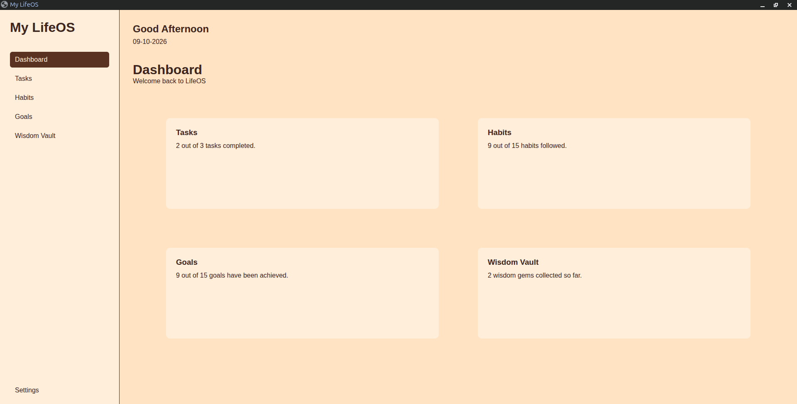
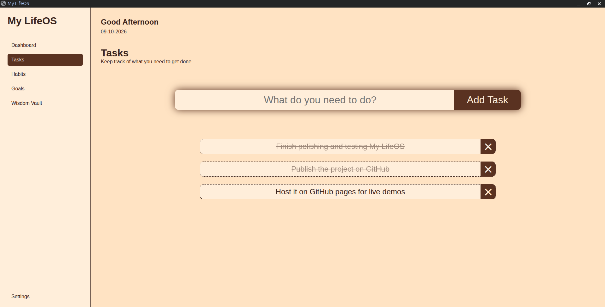
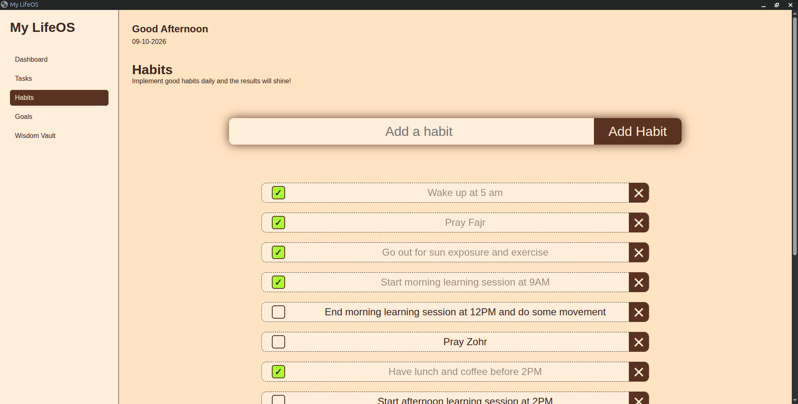
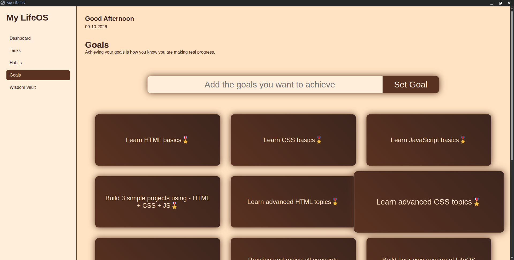
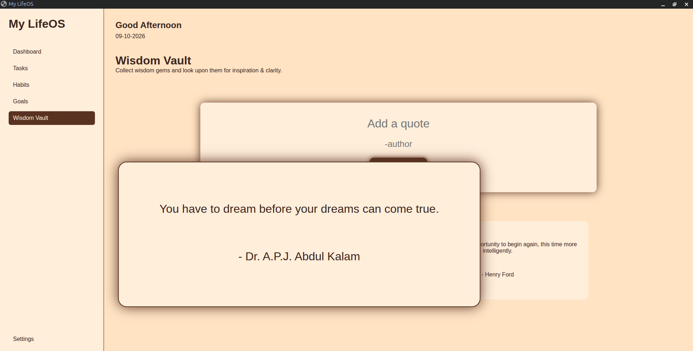
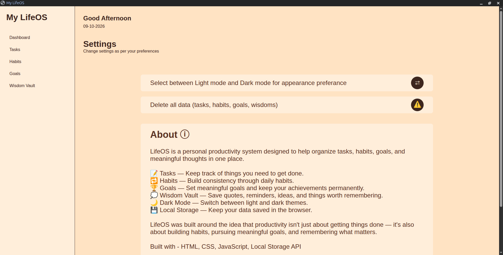

# My LifeOS

My LifeOS is a simple personal productivity app I built while learning web development. I made it to keep track of my daily tasks, habits, goals, and wisdoms in one place.

## Screenshots

### Dashboard

### Tasks

### Habits

### Goals

### Wisdom Vault

### Settings

## Features

* **Dashboard** — A quick overview of my productivity.
* **Tasks** — Add, complete, and delete tasks.
* **Habits** — Keep track of habits.
* **Goals** — Keep track of personal goals.
* **Wisdom Vault** — Collect Wisdom gems and store them as a favourite collection.
* **Local storage** — Saves data in the browser so it stays there when I reopen the app.

## Built With

* HTML
* CSS
* JavaScript
* Browser Local Storage

## Try It Out

**Live Demo:** [My LifeOS](https://syed-asad-745.github.io/MyLifeOS/)

## Run Locally

1. Download or clone this repository.
2. Open the project folder.
3. Open `index.html` in your browser.

No extra setup is required.

## What I Learned

While building this project, I got more practice with JavaScript, DOM manipulation, event handling, managing application state, and saving data with local storage. I also learned how to use Git and GitHub to upload and publish a project.

This is one of my projects as a beginner in web development, and I plan to keep improving it as I learn more.
